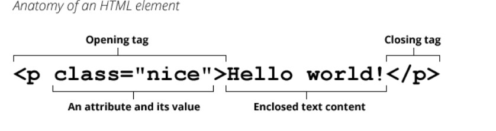

# About HTML Again

##  **what is it ?**
#
**HTML**  (HyperText Markup Language) is a descriptive language that specifies webpage structure.
#
## **How Dose is it specifies webpage structure ?**

basically **HTML** is a plaintext document containing components is called an HTML document. Opening and closing tags are used to enclose elements. Angle brackets (>) start and finish each tag. Some tags, such as image>, are empty or void and cannot contain any text. attributes can be added to HTML tags to provide them more information that affects how the browser understands the element.
#

* HTML Uses Elements
to Describe the
Structure of Pages.. 

* Tags act like containers. They tell you
something about the information that lies
between their opening and closing tags.
Description.

* Attributes provide additional information
about the contents of an element. They appear
on the opening tag of the element and are
made up of two parts: a name and a value,
separated by an equals sign.
* Opening tags can carry attributes, which tell us more
about the content of that element.
 Attributes require a name and a value

 ## The evolaution of HTML attributes
 
 Since the web was first created, there have been several different versions of HTML.

**HTML 4**

Although HTML 4 had some presentational elements to control the appearance of pages, authors are not recommended to use them any more. (Examples include the `
` element for centering content on a page, `` for controlling the appearance of text, and `<strike>` to put a line through the text — all of these can be achieved with CSS instead.)

**XHTML 1.0**

Released 1997
Since HTML was the most widely used markup language around, it was decided that HTML 4 should be reformulated to follow the rules of XML and it was renamed XHTML. This meant that authors had to follow some new, more strict rules about writing markup.

**HTML 5**

Released 2000 Despite the fact that HTML5 is not yet completed, you can safely take advantage of the new features of the language as long as you endeavour to ensure that users with older browsers will be able to view your pages (even though some of the extra features will not be visible to them).

# Features that has been added with HTML5 language :

**DOCTYPEs**

Because there have been several versions of HTML, each web page should begin with a DOCTYPE declaration to tell a browser which version of HTML the page is using (although browsers usually display the page even if it is not included). 

**comments in HTML**
If you want to add a comment to your code that will not be visible in the user's browser, you can add the text between these characters:

`<!-- comment goes here -->`

**ID attribute** 

Every style HTML element can carry the id attribute. It is used to uniquely identify that element from other elements on the page.

**Class attribute**

Every HTML element can also carry a class attribute. Sometimes, rather than uniquely identifying one element within a document, you will want a way to identify several elements as being different from the other elements on the page.

**Block Elemnts**
Some elements will always appear to start on a new line in the browser window. These are known as block level elements. Examples of block elements are `<h1>, 
, <ul>`, and `<li>`.

**Inline Elements**

Some elements will always appear to continue on the same line as their neighbouring elements. These are known as inline elements. 

**IFrames**

An iframe is like a little window that has been cut into your page — and in that window you can see another page. The term iframe is an abbreviation of inline frame. 

**Escape charcter**

There are some characters that are used in and reserved by HTML code. (For example, the left and right angled brackets.)

**Summary**

* DOCTYPES tell browsers which version of HTML you are using.

* You can add comments to your code between the `<!-- and -->`markers.

* The id and class attributes allow you to identify particular elements.

* The `
 and ` elements allow you to group block-level and inline elements together.

* The <meta> tag allows you to supply all kinds of information about your web page.

* Escape characters are used to include special characters in your pages such as `<`,` >`, and` ©`.

 # Process & Design
Every website should be created with the target audience in mind, rather than simply for you or the site owner. As a result, it's critical to know who your target audience is. It's a good idea to ask some questions about the folks you think you'd be interested in.the topic of your website If you ask a client who a website belongs to, they will tell you. It is not unusual for them to do so to respond with "the entire world" .

In reality it is unlikely to be of interest to everyone. Even though most individuals who use computers need light bulbs, they are unlikely to order them from someone in another nation if your website sells them. Even if the site has a broad appeal, consider the demographics of a representative sample of the intended audience.

# Target Audience

## individuals :

* What is your target audience's age range?

* Will your website be more appealing to women or men? What exactly is the concoction?

* What nation are your visitors from?

* Do they reside in the city or in the country?
What is the typical visitor's income?

## Companies:

* What is the firm or relevant department's size?

* What is the status of those who visit your website from your company?

* Will visitors use the site for their own benefit or for the benefit of others?

* What is the size of the budget they have control over?

# Why People Visit YOUR Website ?
Now that you know who your visitors are, think about why they've come. While some visitors will visit your website by accident, the majority will do so for a specific reason.

The aims of your consumers should impact your content and design. There are two types of questions you may ask to assist you figure out why people are visiting your website:

* The initial step was to figure out why people came to the site in the first place.

* The second evaluates the visitors' precise objectives. These are the events that have brought them to the site right now.

# Site Maps
The goal is to develop a page diagram that will be utilized to structure the website. This is referred to as a site map, and it shows how those pages can be organized. You may use a method called card sorting to help you select what information should go on each page.

Example:

# WireFrames
A wireframe is a simple sketch of the key information that needs to go on each page of a site. It shows the hierarchy of the information and how much space it might require.

# Summary
* It's important to understand who your target audience is, why they would come to your site, what information they want to find and when they are likely to return.

* X Site maps allow you to plan the structure of a site.

* Wireframes allow you to organize the information that will need to go on each page.

* Design is about communication. Visual hierarchy helps visitors understand what you are trying to tell them.

# JavaScript
how JavaScript can be used in browsers to make websites more interactive, interesting, and user-friendly.

## Intro + Scripts
How JavaScript Makes Web Pages More Interactive ?

## Access Content

* You can use JavaScript to select any element, attribute, or text from an HTML page.
Modyfiyng Content

* You can use JavaScript to add elements, attributes, and text to the page, or remove them.
Program Rules

* You can specify a set of steps for the browser to follow (like a recipe), which allows it to access or change the content of a page.
React to Events

* You can specify that a script should run when a specific event has occurred.

# The ABC of programming
Before you learn how to read and write the JavaScript language itself, you need to become familiar with some key concepts in computer programming. They will be covered in three sections:

## What is the Script and how i do a one ?

* To write a script, you need to first state your goal and then list the tasks that need to be completed in order to achieve it.

* Once you know the goal of your script, you can work out the individuial tast needed to achive ti.

* Designing A script steps: Each individuial task may be broken down into a sequance of steps. When you are ready to code the script, these steps can the be translated into individuail line of code.

# Expressions & Operators

We use a variable to illustrates how a scrip( contains very explicit instructions about exactly what you want the computer to do).

* What is a variable
A script will have to temporarily store the bits of information it.

# Rules for naming variables
Here are six rules you must always follow when giving a variable a name:

* The name must begin with a letter, dollar sign ($),or an underscore (_). It must not start with a number.

* The name can contain letters, numbers, dollar sign ($), or an underscore (_). Note that you must not use a dash(-) or a period (.) in a variable name..

* You cannot use keywords or reserved words. Keywords are special words that tell the interpreter to do something. For example, var is a keyword used to declare a variable. Reserved words are ones that may be used in a future version of JavaScript.

* All variables are case sensitive, so score and Score would be different variable names, but it is bad practice to create two variables that have the same name using different cases.

* Use a name that describes the kind of information that the variable stores. For example, fi rstName might be used to store a person's first name, l astNarne for their last name, and age for their age. 6. If your variable name is made up of more than one word, use a capital letter for the first letter of every word after the first word. For example, f i rstName rather than fi rstnarne (this is referred to as camel case). You can also use an underscore between each word (you cannot use a dash).

# Arrays
An array is a special type of variable. It doesn't just store one value; it stores a list of values.

You should consider using an array whenever you are working with a list or a set of values that are related to each other.

Creating an array
You create an array and give it a name just like you would any other variable (using the var keyword followed by the name of the array).

`var colors;`
`colors = ['white', 'black', 'custom'];`
`var el = document.getElementById('colors');`
`el.textContent = colors[0];`
# Values in the Array
Values in an array are accessed as if they are in a numbered list. It is important to know that the numbering of this list starts at zero (not one).

# Numbering Items in Array

Each item in an array is automatically given a number called an index. This can be used to access specific items in the array. Consider the following array which holds three colors:

`var colors;`

`colors = ['white', 'black', 'custom'];`

Confusingly, index values start at 0 (not 1), so the following table shows items from the array and their corresponding index values:

    Index   Value

      0     'white'
      1     'black'
      2     'custom'
Accessing items in an array To retrieve the third item on the list, the array name is specified along with the index number in square brackets.

Here you can see a variable called i temThree is declared. Its value is set to be the third color from the co 1 ors array.

`var itemThree;`
`itemThree = colors[2];`

## number of items in an array

Each array has a property called length, which holds the number of items in the array.

Below you can see that a variable called numCo 1 ors is declared. Its value is set to be the number of the items in the array.

The name of the array is followed by a period symbol (or full stop) which is then followed by the 1 ength keyword.

`var numColors; `

`numColors = colors.length;`
# Expressions

An expression evaluates into (results in) a single value. Broadly speaking there are two types of expressions.

Expressions that just assign value to a variable.

`var color = 'beige';`

the value of color now is beige. Expressions that use tow or more values to return a single value.

You can perform operations on any number of individual values (see next page) to determine a single value. For example:

`var area = 3 * 2;`

the variable of area is now 6.
