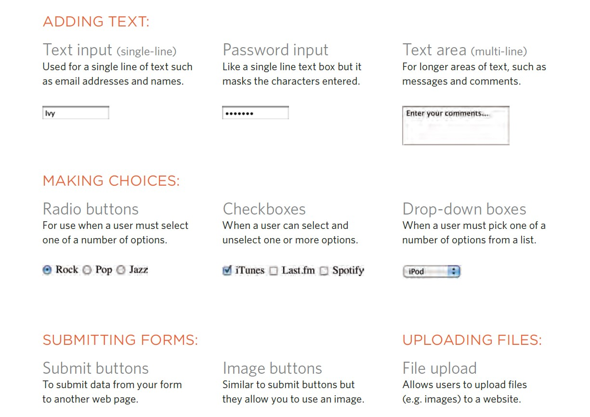

# Forms and JS Events

## Forms in HTML 

## Why Forms?

An HTML form is used to collect user input. The user input is most often sent to a server for processing.

There are several types of form controls that
you can use to collect information from visitors
to your site.

## Form Structure

## **`<form>`**

Form controls live inside a
`<form>` element. This element
should always carry the action
attribute and will usually have a
method and id attribute too.
action

Every `<form>` element requires
an action attribute. Its value
is the URL for the page on the
server that will receive the
information in the form when it
is submitted.

The `<form>` element is a container for different types of input elements, such as: text fields, checkboxes, radio buttons, submit buttons, etc.

All the different form elements are covered in this chapter: HTML Form Elements.

* `<input>`

* `<label>`

* `<select>`

* `<textarea>`

* `<button>`

* `<fieldset>`

* `<legend>`

* `<datalist>`

* `<output>`

* `<option>`

* `<optgroup>`

## Summary for Forms

* Whenever you want to c XX ollect information from
visitors you will need a form, which lives inside a
`<form>` element.

* Information from a form is sent in name/value pairs.

* Each form control is given a name, and the text the user types in or the values of the options they select are sent to the server.

* HTML5 introduces new form elements which make it easier for visitors to fill in forms.

# JS Events

When you browse the web, your browser registers different types of events. It’s the browser’s way of saying, “Hey, this just happened.” Your script can then respond to these events.

## Event Flow
Html Elements nest inside other elements, if you hover or click on a link, you will also be hovring or clicking on it’s parent element.

* Event handlers/ listners can be bound to the containing html elements plus document object and window object. the order in which events fire is know as event flow, and events flow in two directions.

* Events are the browser’s way of indicating when something has happened (such as when a page has finished loading or a button has been clicked).

* Binding is the process of stating which event you are waiting to happen, and which element you are waiting for that event to happen upon.

* When an event occurs on an element, it can trigger a JavaScript function. When this function then changes the web page in some way, it feels interactive because it has responded to the user.

* You can use event delegation to monitor for events that happen on all of the children of an element.

* The most commonly used events are W3C DOM events, although there are others in the HTMLS specification as well as browser-specific events

# Summary

* Events are the browser's way of indicating when something has happened (such as when a page has finished loading or a button has been clicked).

* Binding is the process of stating which event you are waiting to happen, and which element you are waiting for that event to happen upon. When an event occurs on an element, it can trigger aJavaScript function. 

* When this function then changes the web page in some way, it feels interactive because it has responded to the user.

* You can use event delegation to monitor for events that happen on all of the children of an element.

* The most commonly used events are W3C DOM events, although there are others in the HTMLS specification as well as browser-specific events.